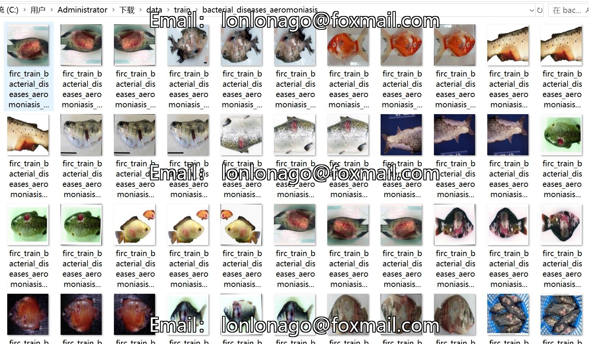
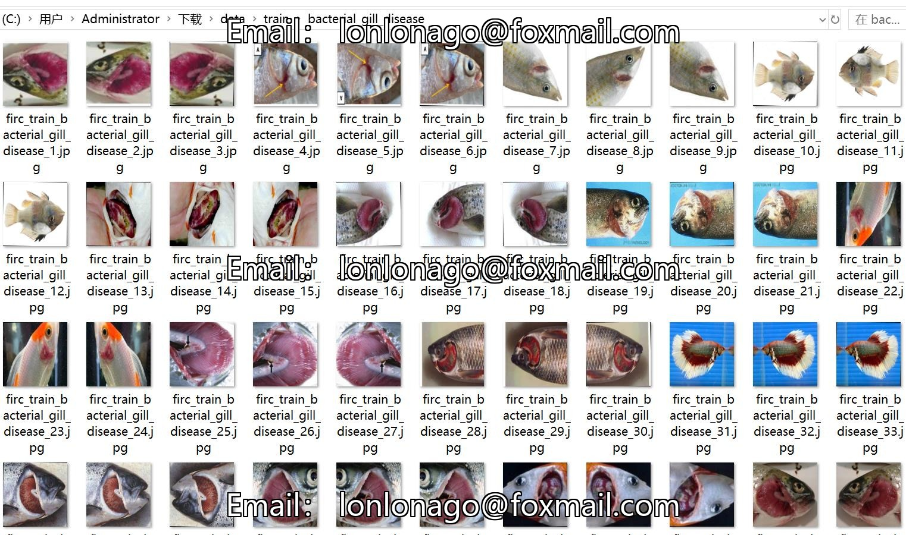
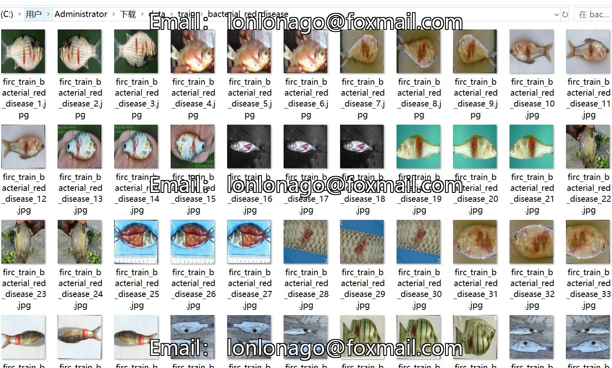
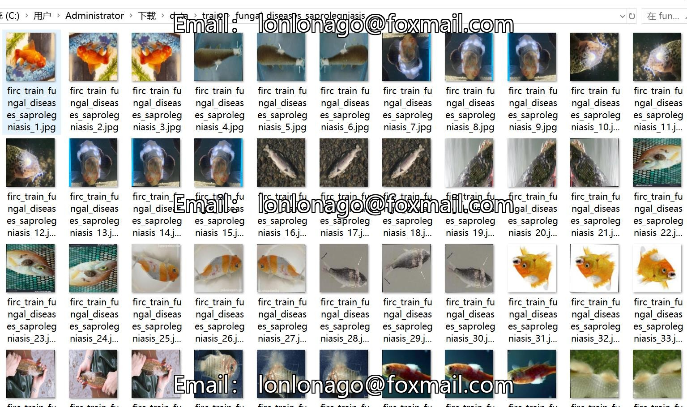

# Dataset of Fish Disease Identification and Classification with 1184 Images in 7 Categories, Divided into Train, Validation, and Test Sets

Note that the dataset image contains 450 original images, and the remaining are enhanced generated.
Dataset Type: Image classification for use, not suitable for object detection without annotation file.
Dataset Format: Only contains jpg images, each classfile folder contains corresponding image.
number of images: 1184  
number of classes: 7  
category names:['bacterial_diseases_aeromoniasis','bacterial_gill_disease','bacterial_red_disease','fungal_diseases_saprolegniasis','healthy_fish','parasitic_diseases','viral_diseases_white_tail_disease']  
images per class:   
training set image count: 1095  
- Bacterial Diseases Aeromonas Training Set Image Count: 117
- Bacterial Gill Disease (Bacterial Gill Disease) Training Set Image Count: 135
Bacterial Red Disease (Bacterial Red Disease) Training Set Image Count: 102
- Fungal Diseases Saprolegniasis (Fungal Diseases - Saprolegniasis) Training Set Image Count: 120
- healthy_fish training set image count: 432
- parasitic_diseasestraining set image count: 90
- Viral Diseases Whitetail Disease Training Set Image Count: 99
validation set image count: 44  
- bacterial_diseases_aeromoniasisvalidation set image count: 5
- bacterial_gill_diseasevalidation set image count: 5
- bacterial_red_diseasevalidation set image count: 8
- fungal_diseases_saprolegniasisvalidation set image count: 4
- healthy_fishvalidation set image count: 17
- parasitic_diseasesvalidation set image count: 1
- viral_diseases_white_tail_diseasevalidation set image count: 4
test set image count: 45  
Bacterial Diseases: Aeromonas Test Set Image Count: 5
- Bacterial Gill Disease (Bacterial Gill Disease) Test Set Image Count: 7
The test set image count for the bacterial red disease is 4.
- Fungal Diseases Saprolegniasis (Fungal Disease - Saprolegniasis) Test Set Image Count: 2
Healthy fish test set image count: 16
- Parasitic Diseases (Parasitic Diseases) Test Set Image Count: 7
The test set image count for the "Viral Diseases Whitetail Disease" is 4.
total images:   
- Bacterial Diseases: Aeromonas - 127 images
- Bacterial Gill Disease: Aeromonas - 147 images
- Bacterial Red Disease: Aeromonas - 114 images
- Fungal Diseases: Saprolegniasis - 126 images
- Healthy Fish: 465 images
- Parasitic Diseases: - 98 images
- Viral Diseases: White Tail Disease - 107 images
Important Notes: There are no notes currently.
Special Statement: This dataset does not guarantee any accuracy for the models or weight files trained on it.
image preview:
## Images

Here is a pay link on Stripe ( https://buy.stripe.com/3cs8yP7sY87d0vu9AB ). Please contact me lonlonago@foxmail.com after funding $89, and I will send you a complete data files , thank you!

